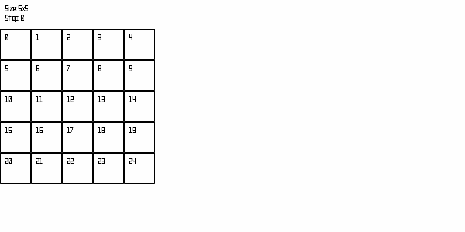

# Codegames
An NES style Tank game, where players program a Tank to play against other Tanks.

# General Rules:
- You play on a square grid.
- You provide a program for a Tank that can move, turn, shoot, and scan.
- The Tank is placed on a random cell on the grid, facing a random direction.
- You cannot communicate with the Tank during the game.
- Your goal is to hit with a shot opponent's tank, while not being hit first.
- Shots travel (not instant) in the direction of fire in a straight line until they hit a tank, another shot or the edge of the grid.

## Read more:
- [Detailed game description](./01_game.md)
- [Game Step Engine](./02_engine.md)
- [Programming Interface](./03_programming.md)
- [API Reference](./04_api.md)